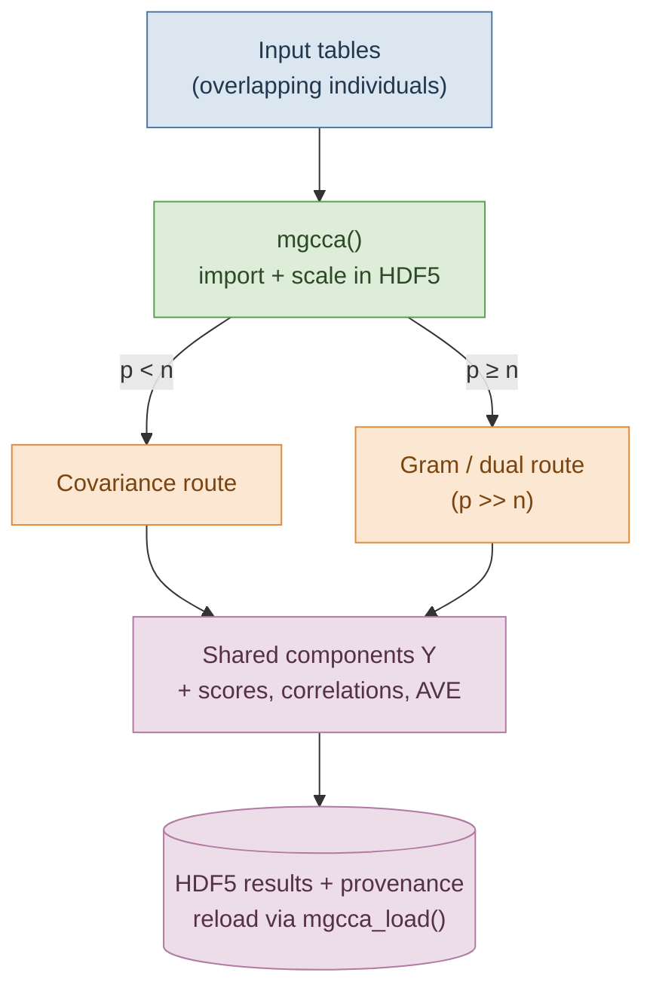

# mgcca

<!-- badges: start -->
[](https://github.com/isglobal-brge/mgcca/actions/workflows/R-CMD-check.yaml)
[](https://opensource.org/licenses/MIT)
<!-- badges: end -->

> Generalized Canonical Correlation Analysis with **missing individuals**,
> computed **out-of-core** on HDF5 through
> [BigDataStatMeth](https://github.com/isglobal-brge/BigDataStatMeth).

`mgcca` integrates several data tables into a small set of shared latent
components, even when the tables describe **overlapping but not identical** sets
of individuals — the setting of multi-omics integration, where a subject may be
measured in some layers and not others. Missing individuals are handled
analytically (van de Velden & Takane), so every individual in the union is
represented **without imputation** and **without dropping incomplete cases**.

The numerical core runs entirely in C++ on HDF5 files via the BigDataStatMeth
API, so a single call, `mgcca()`, scales from small tables to full-omics data
(hundreds of thousands of features) **without ever loading a whole table into
memory** and without forming any variable-by-variable matrix.

## How it works



Missing individuals are encoded per table, so a subject absent from a table
simply does not contribute to it. Wide tables (`p >= n`, e.g. methylation) take
the Gram route and never form a `p x p` matrix; results and the provenance
needed to reload them are written back to the HDF5 file.

## Installation

`mgcca` depends on BigDataStatMeth (GitHub) and on Bioconductor packages
(`Rhdf5lib`, `MultiAssayExperiment`, …):

```r
# install.packages("remotes")
# install.packages("BiocManager")

# Bioconductor dependencies
BiocManager::install(c("Rhdf5lib", "MultiAssayExperiment",
                       "GenomeInfoDb", "BiocStyle"))

# the out-of-core engine
remotes::install_github("isglobal-brge/BigDataStatMeth")

# mgcca
remotes::install_github("isglobal-brge/mgcca")
```

An HDF5 toolchain is required (provided by `Rhdf5lib`) together with a C++17
compiler.

## Quick start

```r
library(mgcca)

# a shipped 3-table cardiovascular example with missing individuals
data(cardiovascular)
X <- list(methylation = as.matrix(X1),
          clinical    = as.matrix(X2),
          other       = as.matrix(X3))
X <- lapply(X, function(m) { storage.mode(m) <- "double"; m })

# fit: import -> scale in-file -> compute shared components (all on HDF5)
fit <- mgcca(X, filename = tempfile(fileext = ".h5"),
             method = "solve", scores = TRUE)

fit                    # compact overview
summary(fit, top = 4)  # variance explained + top variables per component
plotIndividuals(fit)   # individuals on the two shared components (a ggplot)
```

Results are written to the HDF5 file together with a self-describing provenance
manifest, so a finished analysis can be reopened later **from the file alone**:

```r
fit <- mgcca_load("analysis.h5")   # no R session or .rds needed
```

## Features

- **One entry point** `mgcca()` — import (list of matrices,
  `MultiAssayExperiment`, `SummarizedExperiment`/`ExpressionSet`, or an HDF5
  file), scale in-file, and fit; returns an `"mgcca"` object.
- **Scales to `p >> n`.** A per-table algebra route (`route = "auto"`) uses the
  Gram/dual formulation for wide tables, so integrating e.g. full methylation
  (~485k features) never forms a `p x p` matrix.
- **Inversion methods:** `solve`, `penalized` (per-table `lambda`),
  `geninv`/`ginv` (Moore–Penrose).
- **Reload & provenance:** `mgcca_load()` rebuilds the full object from the HDF5
  file; `mgcca_results()` collects the numeric blocks.
- **Downstream analysis:** `mgcca_associate()` (component ~ phenotype R²/p),
  `mgcca_permtest()`, and out-of-sample `predict()`.
- **Plots (ggplot2):** `plotIndividuals()` (with confidence ellipses),
  `plotVariables()` (correlation circle), `plotLoadings()`, `plotScores()`,
  `plotBiplot()`, `plotAVE()`, `plotScree()`.
- **S3 methods:** `print`, `summary`, `plot`, `predict`.

## Documentation

- Package website (pkgdown): <https://isglobal-brge.github.io/mgcca/>
- Getting-started vignette: `vignette("mgcca_example", package = "mgcca")`
- Method and implementation notes accompany the package (see the project's
  technical documentation).

## Method

`mgcca` implements Generalized Canonical Correlation Analysis with missing
individuals: given tables `X_j` (individuals × variables) and per-table
presence indicators `K_j`, it estimates shared components `Y` as the leading
eigenvectors of a whitened sum of per-table projection operators. See the
vignette and the references below for the formulation.

## References

- van de Velden, M. and Takane, Y. (2012). *Generalized canonical correlation
  analysis with missing values.* Computational Statistics.
- van de Velden, M. (2006). Related GCCA formulation used here.

## Citation

```r
citation("mgcca")
```

## License

MIT © Institute for Global Health (ISGlobal), Bioinformatics Research Group in
Epidemiology (BRGE). See [LICENSE](LICENSE).
