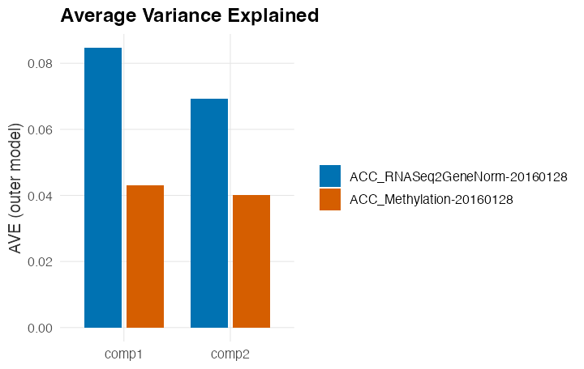

```{r setup, include=FALSE}
knitr::opts_chunk$set(echo = TRUE, message = FALSE, warning = FALSE,
                      fig.width = 6, fig.height = 6)
```

# Introduction

This vignette shows how to integrate several data tables with `mgcca`,
Generalized Canonical Correlation Analysis with *missing individuals* (whole
missing rows; van de Velden and Bijmolt, 2006). A shared set of latent
components is estimated across
tables even when the tables do not share exactly the same individuals: an
individual absent from a table simply does not contribute to that table.

The single entry point, `mgcca()`, has two backends chosen by whether you pass a
`filename`. **With a `filename`** the whole numerical core runs in **C++ on HDF5
files** through the
[`BigDataStatMeth`](https://github.com/isglobal-brge/BigDataStatMeth) API, so it
scales from small tables to full-omics tables (hundreds of thousands of features)
*without ever loading a table completely into memory* and without forming any
variable-by-variable matrix; the results are written to the HDF5 file and can be
pulled back into a compact R object for plotting with `mgcca_results()` (or
`mgcca(..., collect = TRUE)`). **With `filename = NULL`** the same call fits
*in memory* in pure R instead, for tables that fit in RAM -- no HDF5 file is
written. The two backends return the same `"mgcca"` object; the in-memory fit is
not written to disk, so it is not reloadable with `mgcca_load()` and the
reliability analyses (`mgcca_sensitivity()`, `mgcca_stability()`), which read the
source blocks from HDF5, require a file-backed fit.

# Installation

`mgcca` is installed from Bioconductor:

```{r install, eval=FALSE}
if (!require("BiocManager", quietly = TRUE))
    install.packages("BiocManager")

BiocManager::install("mgcca")
```

```{r load_library}
library(mgcca)
```

# A self-contained example

The package ships a small multi-table cardiovascular data set with three tables
that do **not** share the same individuals -- exactly the situation `mgcca` is
designed for. Each table has individuals in rows (identified by their row names)
and variables in columns.

```{r cardio_data}
data(cardiovascular, package = "mgcca")

X <- list(methylation = as.matrix(X1),
          clinical    = as.matrix(X2),
          other       = as.matrix(X3))
X <- lapply(X, function(m) { storage.mode(m) <- "double"; m })

# Different number of individuals per table -> missing individuals
sapply(X, dim)
length(Reduce(union, lapply(X, rownames)))   # size of the individual union
```

## Running mgcca

`mgcca()` imports the tables into an HDF5 file, scales each variable
(column-centre and standardise, done out-of-core inside the file), and computes
the shared components. The tables here are small (few variables relative to
individuals), so `method = "solve"` is well conditioned; for wide/omics tables
use `"penalized"` (with a `lambda` per table) or `"geninv"`.

Passing `collect = TRUE` returns an object of class `"mgcca"` (holding `Y`, the
per-table `corsY`/`pval.cor`, `scores` and `AVE`) ready for the plotting
helpers. The full results also remain in the HDF5 file.

```{r cardio_run}
h5file <- tempfile(fileext = ".h5")

fit <- mgcca(X, filename = h5file, nfac = 2,
             method = "solve", scores = TRUE, collect = TRUE)

fit                       # print method: a compact overview
```

`summary()` adds the variance explained per table and the variables most
correlated with each shared component:

```{r cardio_summary}
summary(fit, top = 4)
```

## Individuals plot

`plotIndividuals()` projects the individuals onto the two shared components and
returns a `ggplot` object you can further style. A grouping factor -- a
phenotype, a clinical category, a cluster -- can be supplied to colour the
points.

To pick a *meaningful* one, look at which clinical variables actually drive the
shared components (their correlation with each component):

```{r cardio_clin_load}
round(fit$corsY[["clinical"]], 3)
```

Cholesterol (LDL, total cholesterol) loads most on the first component, whereas
BMI barely does -- so LDL categories will show structure while BMI would not. We
build LDL clinical categories (NCEP ATP III cut-points) and align them to the
individuals of the analysis (those absent from the clinical table stay `NA`):

```{r cardio_group}
ldl <- X$clinical[, "LDL"]                        # real LDL values (mg/dL)
ldl <- ldl[rownames(fit$Y)]                       # align to the individual union
ldl_group <- cut(ldl, breaks = c(-Inf, 100, 160, Inf),
                 labels = c("optimal", "borderline", "high"))
table(ldl_group, useNA = "ifany")
```

```{r cardio_plotInds, fig.width=6, fig.height=4.6}
plotIndividuals(fit, group = ldl_group)
```

The 95% confidence ellipses (one per group) make the shift along the first
component clear -- the *optimal* ellipse sits to the right, the *high* ellipse to
the left -- even though the individual points overlap heavily.

Contrast this with BMI, which (as the loadings above anticipated) barely aligns
with the shared components: colouring by BMI category gives essentially
concentric ellipses, i.e. no separation.

```{r cardio_plotInds_bmi, fig.width=6, fig.height=4.6}
bmi <- X$clinical[, "BMI"][rownames(fit$Y)]
bmi_group <- cut(bmi, breaks = c(-Inf, 25, 30, Inf),
                 labels = c("normal", "overweight", "obese"))
plotIndividuals(fit, group = bmi_group, title = "Individuals by BMI category")
```

The ellipses can be switched off with `ellipse = FALSE`.

## Variables plot

`plotVariables()` draws, for one table, the correlation of each variable with the
two shared components as a *correlation circle*. Only the `top` variables (by
correlation radius) are labelled, so it stays readable for omics-scale tables.

```{r cardio_plotVars, fig.width=5.5, fig.height=5.5}
plotVariables(fit, table = "clinical", top = 6)
```

`plotLoadings()` is a complementary view: the signed correlation of the top
variables with a single component as a bar chart (here it makes the
cholesterol-vs-glucose split of component 1 explicit).

```{r cardio_loadings, fig.width=6, fig.height=4}
plotLoadings(fit, table = "clinical", comp = 1, top = 6)
```

## Variance explained

`plotAVE()` shows how much of each table's variance each shared component
captures (outer-model AVE); `plotScree()` shows the component eigenvalues.

```{r cardio_ave, fig.width=6, fig.height=4}
plotAVE(fit)
plotScree(fit)
```

## Significant variables

`getSignif()` lists the variables significantly correlated with any component and
`topVars()` returns the strongest ones.

```{r cardio_signif}
head(getSignif(fit, pval.cut = 1e-3))
topVars(fit, axis = 1, topN = 5)
```

# Saving and reloading results

Every `mgcca()` run writes its results to the HDF5 file, and *together with them*
a small **provenance manifest** stored as native HDF5 attributes: the method,
`lambda`, the algebra `route` taken per table, the number of components, the
table names, the eigenvalues and the package version/date. The manifest is
attached to the `FINAL_RESULTS` group (run-level facts) and to each
`FINAL_RESULTS/corsY/<table>` dataset (the per-table `lambda` and `route_dual`),
so the results file is **self-describing**.

Because of this, a finished analysis can be reopened later from the file alone --
no need to keep the R session, a saved `.rds`, or even to remember how it was
run. `mgcca_load()` reads the manifest and the numeric blocks and rebuilds the
full `"mgcca"` object:

```{r reload}
# forget the in-memory object; everything needed is on disk
rm(fit)

fit <- mgcca_load(h5file)          # rebuilt straight from the HDF5 file
fit
```

The reconstructed provenance is available on the object's descriptor:

```{r reload_desc}
desc <- attr(fit, "desc")
desc$method                        # "solve"
desc$route                         # "auto"
desc$route_dual                    # per-table: covariance vs Gram route
desc$eig_values                    # shared-component eigenvalues
```

All the plotting and post-analysis helpers work on the reloaded object exactly as
before:

```{r reload_use, fig.width=6, fig.height=4.6}
plotIndividuals(fit, group = ldl_group)
```

If you only need the numeric blocks (no provenance, no `"mgcca"` wrapper), the
lower-level reader `mgcca_results(h5file)` returns them directly.

# How it scales to omics data

The same file-backed call (with a `filename`) works on omics-scale tables. Two
things make this possible:

* **Out-of-core, in HDF5.** Import writes the raw tables to the file; scaling,
  cross-products, the eigendecomposition and the scores are all computed by
  `BigDataStatMeth` reading the data in blocks. On this path nothing forces a
  whole table into RAM. (The in-memory backend, `filename = NULL`, is the
  opposite trade-off: it holds the tables in RAM and is meant for tables that
  fit, not for omics-scale data.)
* **Per-table algebra route (`route = "auto"`).** For a table with more variables
  than individuals (`p > n`, e.g. methylation with hundreds of thousands of CpGs)
  `mgcca` uses the Gram route (an *n x n* matrix), never the *p x p* covariance
  matrix, which would be intractable. For `p < n` it uses the covariance route.
  `route = "cov"` or `"dual"` force one route for every table.

So the very same `mgcca(..., method = "penalized", lambda = ...)` that runs on
a 100-variable subset also runs, unchanged, on the full methylation table
(~485k features), completing in seconds without exhausting memory.

# A real omics case study: TCGA adrenocortical carcinoma

Adrenocortical carcinoma (ACC) is a rare, aggressive endocrine cancer. The TCGA
ACC cohort provides, for 80 patients, two omics layers -- **RNA-seq** gene
expression and **DNA methylation** -- together with rich clinical annotation
(tumour stage, survival, treatment, ...). We integrate the two layers with
`mgcca` and then ask a biologically meaningful question: *do the shared
components capture clinical structure?*

The code below is shown but **not evaluated** when the vignette is built (it
downloads several hundred MB and needs `curatedTCGAData`/`TCGAutils`). The
outputs and figures underneath are the **actual result** of running it on the
full data -- RNA-seq (20,501 genes) and methylation (485,577 CpGs) for all 80
patients -- which completes in about 30 seconds. Both tables have `p >> n`, so
both take the Gram route and no variable-by-variable matrix is ever formed.

## Download, impute and assemble the tables

```{r tcga_prep, eval=FALSE}
library(curatedTCGAData); library(TCGAutils); library(MultiAssayExperiment)

mae <- curatedTCGAData("ACC", c("RNASeq2GeneNorm", "Methylation"),
                       dry.run = FALSE, version = "1.1.38")
mae <- impute(mae, method = "knn", k = 10, rowmax = 0.5, colmax = 0.8,
              remove.col = TRUE, impute.zero = TRUE)

# individuals x variables, aligned by the 12-char sample ID; methylation -> numeric
tables_list <- getTables(mae)
for (a in seq_along(tables_list))
  rownames(tables_list[[a]]) <- substr(rownames(tables_list[[a]]), 1, 12)
tables_list <- matrix.chr2num(tables_list, index = 1)
```

## Integrate the two layers

```{r tcga_run, eval=FALSE}
fit <- mgcca(tables_list, filename = tempfile(fileext = ".h5"), nfac = 2,
             method = "penalized", lambda = c(0.75, 1),
             scores = TRUE, route = "auto", collect = TRUE)

attr(fit, "desc")$route_dual   # both TRUE: methylation and RNA-seq both p >> n
summary(fit, top = 4)
```

The `summary()` output (real result on the full data):

```
Generalized Canonical Correlation Analysis (mgcca)
  tables      : 2  (ACC_RNASeq2GeneNorm-20160128, ACC_Methylation-20160128)
  individuals : 80
  components  : 2
  eigenvalues : 1, 1
  AVE (outer) : 0.04473, 0.04128
  scores      : available (per table)

AVE per table (outer model):
                              comp1  comp2
ACC_RNASeq2GeneNorm-20160128 0.0847 0.0692
ACC_Methylation-20160128     0.0430 0.0401

Top 4 variables per component (correlation with Y):
  [ACC_RNASeq2GeneNorm-20160128]
    comp1: ARHGDIB (-0.79), TBX3 (+0.74), TNFAIP8L2 (-0.73), FLI1 (-0.73)
    comp2: STK25 (-0.81), PRCC (-0.80), ARPC2 (-0.79), ZDHHC16 (-0.77)
  [ACC_Methylation-20160128]
    comp1: cg14278148 (-0.74), cg12653626 (-0.71), cg05796838 (-0.71), cg27641801 (-0.70)
    comp2: cg10815272 (-0.74), cg06495763 (+0.72), cg10469906 (-0.70), cg13301931 (-0.70)
```

## Do the shared components track the disease?

Colouring the individuals by clinical group shows that the integrated axes are
not arbitrary. Tumour **stage** grades along the components (early-stage ellipse
up-left, stage IV down-right), and **vital status** separates survivors from
deceased patients.

```{r tcga_run_plots, eval=FALSE}
stage <- factor(mae$pathologic_stage)
vital <- factor(ifelse(mae$vital_status == "1", "deceased", "alive"))
plotIndividuals(fit, group = stage)   # figure 1
plotIndividuals(fit, group = vital)   # figure 2
```

```{r tcga_fig_inds, echo=FALSE, out.width="49%", fig.show="hold"}
knitr::include_graphics(c("figures/tcga_stage.png",
                          "figures/tcga_individuals.png"))
```

`mgcca_associate()` makes this quantitative: it regresses each shared component
on a phenotype and reports the variance explained and its p-value.

```{r tcga_assoc, eval=FALSE}
mgcca_associate(fit, list(
  stage  = factor(mae$pathologic_stage),
  vital  = factor(mae$vital_status),
  gender = factor(mae$gender)))
```

```
  phenotype component     R2       p   n   p.adj
1     stage         1 0.113   0.030  78   0.045
2     stage         2 0.154 5.9e-03  78   0.018
3     vital         1 0.064   0.023  80   0.045
4     vital         2 0.287 3.1e-07  80   1.9e-06
5    gender         1 0.031   0.115  80   0.138
6    gender         2 0.003   0.630  80   0.630
```

Both components are significantly associated with **tumour stage**, and the
second component is strongly associated with **survival** (p = 3e-07), while
**gender** is not -- the shared signal reflects disease biology, not a technical
or demographic artefact. (`mgcca_permtest()` similarly tests whether the
components themselves are significant against a permuted null.)

## What drives the components

The methylation correlation circle shows the full cloud of 485k CpGs with the
top-correlated ones labelled; `plotLoadings()` lists the strongest CpGs for the
first component; and `plotAVE()` shows how much of each layer each component
captures.

```{r tcga_run_vars, eval=FALSE}
plotVariables(fit, table = "ACC_Methylation-20160128", top = 15)
plotLoadings(fit,  table = "ACC_Methylation-20160128", comp = 1, top = 15)
plotAVE(fit)
```

```{r tcga_fig_vars, echo=FALSE, out.width="49%", fig.show="hold"}
knitr::include_graphics(c("figures/tcga_variables.png",
                          "figures/tcga_loadings.png"))
```

```{r tcga_fig_ave, echo=FALSE, out.width="70%", fig.align="center"}

```

If you only need the results on disk (no in-memory object), drop
`collect = TRUE` and read them back later with `mgcca_results(h5file)`.

## Subsetting by genomic ranges

You can restrict the analysis to features falling in a genomic region. As an
example, features around the *MEN1* locus (a tumour-suppressor gene at 11q13
related to this cancer):

```{r tcga_ranges, eval=FALSE}
library(TxDb.Hsapiens.UCSC.hg19.knownGene)
library(org.Hs.eg.db)

# MEN1 +- 2kb
chr.coords <- GRanges("11:64550986-64578766")

# Annotate RNA-seq with ranges; methylation already carries CpG coordinates
mae.annotated <- TCGAutils::symbolsToRanges(mae)
mae.annotated[[3]] <- NULL                       # drop the unranged part

mae.subset <- genCoords(multiassayexperiment = mae.annotated,
                        gen.coords = chr.coords,
                        meth.index = 1, col.name = "Genomic_Coordinate")

mae.subset.imputed <- impute(mae.subset, method = "knn", k = 10,
                             rowmax = 0.5, colmax = 0.8,
                             remove.col = TRUE, impute.zero = TRUE)

sub_tables <- getTables(mae.subset.imputed)
for (a in seq_along(sub_tables))
  rownames(sub_tables[[a]]) <- substr(rownames(sub_tables[[a]]), 1, 12)
sub_tables <- matrix.chr2num(sub_tables, index = 1)

fit.region <- mgcca(sub_tables, filename = tempfile(fileext = ".h5"),
                        nfac = 2, method = "penalized", lambda = c(0.75, 1),
                        scores = TRUE, collect = TRUE)
plotIndividuals(fit.region, group = factor(mae$vital_status))
```

# Auditing the availability design before fitting

Everything above starts from a fit. `mgcca_audit()` runs *before* one, and
answers a different kind of question: what does the availability design itself
support? It reads who is present in which block -- presence and absence, never a
data value -- and never calls `mgcca()`, so nothing a fit computes can move
because of it.

Take a four-block design over 85 participants. Sixty of them carry methylation,
expression and proteins; the remaining twenty-five carry proteins and
metabolites. Nobody carries methylation and metabolites together.

```{r audit_design}
ids   <- sprintf("ind%02d", 1:85)
core  <- 1:60                          # methylation + expression + proteins
extra <- 61:85                         # proteins + metabolites

avail <- cbind(
  methylation = seq_along(ids) %in% core,
  expression  = seq_along(ids) %in% core,
  proteins    = rep(TRUE, length(ids)),
  metabolites = seq_along(ids) %in% extra)
rownames(avail) <- ids

cohort  <- rep(c("cohort A", "cohort B"), length.out = length(ids))
avail_w <- ifelse(seq_along(ids) %in% core, 1, 3)   # declared design weights

colSums(avail)
```

`L` is the rank of the working model you intend to fit; the audit records it and
compares it against the support counts descriptively. `strata` and `weights` are
what *you* declare about the design, and are given in the audit's own row order.

```{r audit_run}
audit <- mgcca_audit(avail, L = 2, strata = cohort, weights = avail_w)
audit
```

Four pairs are carried directly by participants observed in both blocks.
Methylation--metabolites and expression--metabolites are not: they have no
shared participant at all, but a route of supported pairs runs between them, so
they are coded `MODEL_TRANSFER_ELIGIBLE`. Such a pair is identified conditional
on the declared rank-L model and its required structural conditions, which are
not empirically checked by this audit -- `$structural_checks` says
`not_evaluated`, and at this level it always will. The route itself, and the
support of its weakest edge, are on the record:

```{r audit_paths}
audit$provenance$pairs[, c("block1", "block2", "code", "n_jk", "path",
                           "bottleneck")]
```

The whole connection to metabolites rests on the single proteins--metabolites
edge and the 25 participants behind it. That is **design-support fragility**:
$\kappa_{jk}$ counts the edge-disjoint routes between two blocks, so
$\kappa = 1$ means one edge failing would leave the two sides unconnected. It is
a statement about the design's topology, and says nothing about how well
anything is estimated.

```{r audit_fragility}
audit$graph$bridges
audit$graph$articulation
```

`summary()` adds the availability and representation tables. The three design
lines (`ess_min`, `availability_min`, `max_weight`) are **declared lines carrying
margin**, set by the analyst and configurable; they are not thresholds at which
something fails and they are not estimated from the data. The value that raised
a code is always printed beside it, so how close to the line a cell sits stays
visible: the two metabolites cells below sit at an effective sample size of 13.0
and 12.0 against a declared line of 30, which is not the same situation as one
sitting at 29.8.

```{r audit_summary}
summary(audit)
```

Two cells carry `SEVERE_REPRESENTATION_WARNING`: metabolites is thin in both
cohorts. Note also what the table can and cannot say. A finite entry in it
*evidences* positivity for that cell -- somebody was observed there -- but does
not prove it, and an empty cell may be empty by chance or impossible by design;
the table cannot tell the two apart.

A bare `plot()` draws the same information as a curated four-panel overview:
the pair classification as the anchor, realised availability, representation,
and a small support graph.

```{r audit_plot, fig.wide=TRUE, fig.width=8, fig.height=8.2, out.width="100%"}
plot(audit)
```

**How to read this figure.** Start at the classification matrix on the left --
it is the precise panel, and the other three explain it. Each cell is one pair
of blocks, and its colour is the pair's class and nothing else: blue means the
pair is carried directly by participants observed in both blocks, amber that it
is not, and travels instead through other blocks. Colour never encodes *how
much* support a pair has, which is why a thinly supported blue cell looks
exactly like a richly supported one -- the amount is printed inside the cell.
There is no traffic-light scale and no good/bad axis here: these are properties
of a design, not verdicts on it. The small triangles and squares in the cell
corners are advisories, the top-right panel shows how much of each block each
declared stratum actually has, the bottom-right panel how much weight is behind
it, and the little graph is the same design drawn as a network. Read as a
whole, this composite tells you which relationships your fit will rest on
directly, which will rest on a model, and where the design is thin.

Each panel is also available on its own, and comes back as a `ggplot` you can
restyle or save. The matrix first, full size:

```{r audit_matrix, fig.wide=TRUE, fig.width=8, fig.height=6.6, out.width="100%"}
plot(audit, type = "matrix")
```

**How to read this figure.** Read the lower triangle cell by cell; the diagonal
just carries each block's own number of participants. A **blue** cell prints
$n_{jk}$, the number of participants observed in both blocks -- that pair is
carried by real joint observations. An **amber** cell prints `B=`, and that is
the different and more demanding case: no participant carries both blocks, so
the relationship is reachable only by travelling through others, and it is
identified conditional on the declared rank-L model and its required structural
conditions, which are not empirically checked by this audit. The `B` value is
the weakest link of the route it travels through -- the smallest joint count on
any step of that path -- so `B=25` means the entire relationship leans on 25
participants somewhere along the way. A **light grey** cell means the pair has
neither, and a **darker grey cell with an X** means no participant anywhere
carries both blocks. The corner glyphs are advisories: a triangle where the
support the pair leans on falls below the declared `ess_min` line, a square
where a single edge carries the whole connection. What this decides for you:
amber and grey cells are the relationships to be careful about when you read
the fit, and a triangle tells you the number behind a cell is small even when
its colour is the strongest one.

The graph draws the same design as a network, which makes its shape obvious at
a glance.

```{r audit_graph, fig.wide=TRUE, fig.width=8, fig.height=6.2, out.width="100%"}
plot(audit, type = "graph")
```

**How to read this figure.** Look at the node colours first: they are the
connected components, so blocks sharing a colour can reach each other, through
one step or several, and blocks of different colours cannot be related by this
design at all. Then look at the edges. An edge is a directly supported pair;
its **width** is the raw count of participants observed in both blocks and
nothing else -- never a strength, a quality or a confidence. A **dashed
purple** edge is a single bridge: remove those participants and the two sides
stop being connected. A **solid blue** edge has at least one alternative route
around it. That distinction is *design-support redundancy* -- how many
independent ways the design has of connecting two blocks -- and it is a
statement about the shape of the design, not about how well anything is
estimated. What this decides for you: a single bridge is the place where losing
data would cost you most.

When a pair is reachable only through others, `pair =` draws the route it
depends on.

```{r audit_provenance, fig.wide=TRUE, fig.width=8, fig.height=6.2, out.width="100%"}
plot(audit, type = "graph", pair = c("methylation", "metabolites"))
```

**How to read this figure.** The emphasised path is the route the audit
recorded for this pair, and the faded elements are everything the route does
not use. The label on one edge marks the bottleneck: the weakest step of the
route, and therefore the number the whole relationship rests on. The subtitle
carries the condition and is not decoration -- a model-transfer-eligible pair
is identified conditional on the declared rank-L model and its required
structural conditions, which are not empirically checked by this audit, and if
the audit recorded other equally wide routes the subtitle says so rather than
letting this one look privileged. What this decides for you: whether you are
willing to lean on that route, knowing which participants and which assumption
it rests on.

Availability shows the same design from the participants' side.

```{r audit_availability, fig.wide=TRUE, fig.width=8, fig.height=5.0, out.width="100%"}
plot(audit, type = "availability")
```

**How to read this figure.** One row per declared stratum, one column per
block, and the colour is the proportion of that stratum present in that block.
The scale is pinned to the full range from 0 to 1, never stretched to the range
that happens to occur, so a pale column is genuinely sparse rather than merely
the palest thing in this particular design. The number in each cell is the count
behind the proportion. What this decides for you: a column that is pale in one
stratum and dark in another is a block your cohorts do not contribute to
equally. Note also what the table cannot say. A filled cell *evidences*
positivity for that combination -- somebody was observed there -- but does not
prove it, and an empty cell may be empty by chance or impossible by design;
this table cannot tell those two apart.

Representation asks the same question of the declared weights.

```{r audit_representation, fig.wide=TRUE, fig.width=8, fig.height=5.6, out.width="100%"}
plot(audit, type = "representation")
```

**How to read this figure.** Two panels, the same rows in the same order in
both, and deliberately not one shared axis: a count and a proportion do not
live on the same scale. On the left, the effective sample size -- what the
declared weights leave of the raw count once their spread is taken into
account -- annotated with the size of the stratum it came from, because
comparing effective counts across strata of different sizes is exactly the
mistake this annotation exists to prevent. On the right, the share of each
stratum present in each block. Bar colour is the declared stratum, the same
colour in both panels, so a stratum can be followed across them. The dashed
grey lines are the **declared design lines**: conventional lines set by the
analyst, carrying margin, configurable, and not thresholds at which anything
fails. A bar short of one is worth a look, not an alarm -- and how far short it
falls is visible precisely because everything here is reported as a value.

Finally, the question users of block-wise missing data ask first: which
*combinations* of blocks do participants actually carry?

```{r audit_patterns, fig.wide=TRUE, fig.width=8, fig.height=4.2, out.width="100%"}
plot(audit, type = "patterns")
```

**How to read this figure.** Each row is one combination of blocks that
somebody actually carries. On the left, filled dots mark which blocks that
combination contains; on the right, the bar and its number count the
participants who carry exactly that combination. Rows run most frequent first.
What this decides for you: this is the design in its rawest form, and it
usually explains the rest of the audit at once. Here there are two rows and no
others -- 60 participants carry methylation, expression and proteins, 25 carry
proteins and metabolites -- and that is the whole reason metabolites hangs off a
single edge and reaches the other blocks only through proteins.

## Auditing the object you are about to fit

`mgcca_audit()` also takes the data object itself -- a list of blocks, a
`MultiAssayExperiment`, or an HDF5 file -- and derives the availability table
through the package's own readers, with the same union-of-IDs rule the estimator
uses. Only the participant IDs are read; no block is materialised. Auditing the
very object the fit will consume is what makes the audit a statement about the
actual analysis.

On an HDF5-backed design, `save_hdf5 = TRUE` writes the audit into an
`availability_audit` group of that same file, so the certificate travels with
the data, and `mgcca_audit_load()` brings it back whole.

```{r audit_roundtrip}
set.seed(1)
blocks <- list(
  methylation = matrix(rnorm(60 * 4), 60, 4,
                       dimnames = list(ids[core], paste0("cg", 1:4))),
  expression  = matrix(rnorm(60 * 3), 60, 3,
                       dimnames = list(ids[core], paste0("gene", 1:3))),
  proteins    = matrix(rnorm(85 * 3), 85, 3,
                       dimnames = list(ids, paste0("prot", 1:3))),
  metabolites = matrix(rnorm(25 * 2), 25, 2,
                       dimnames = list(ids[extra], paste0("met", 1:2))))

h5_audit <- tempfile(fileext = ".h5")
desc <- mgcca_import_hdf5(blocks, filename = h5_audit, overwriteFile = TRUE)

stored <- mgcca_audit(desc, L = 2, strata = cohort, weights = avail_w,
                      save_hdf5 = TRUE)

# the availability table derived from the blocks is the one built by hand
identical(unname(stored$table), unname(avail))

# and the stored audit comes back whole
identical(mgcca_audit_load(h5_audit), stored)
```

What is written is structured rather than opaque: the tables go in as datasets,
block and participant names as their dimnames, the status codes as integers with
the frozen vocabulary stored beside them as a legend, and the transfer routes as
sequences of block indices. Any HDF5 browser can read it.

```{r audit_stored}
stored$saved$tables
rownames(as.matrix(
  BigDataStatMeth::hdf5_matrix(h5_audit, "availability_audit/pair_codes")))
BigDataStatMeth::hdf5_close_all()
unlink(h5_audit)
```


# Session information

```{r sesinfo}
sessionInfo()
```
